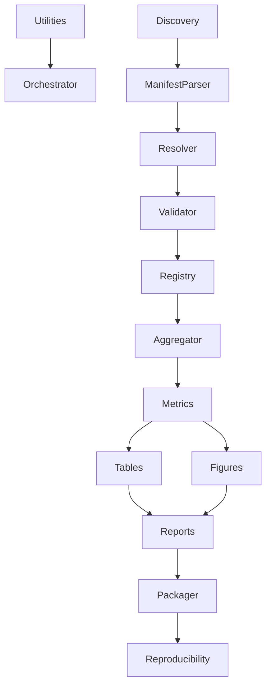
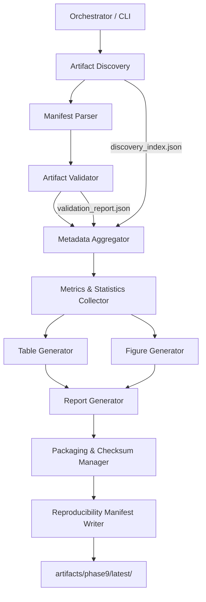
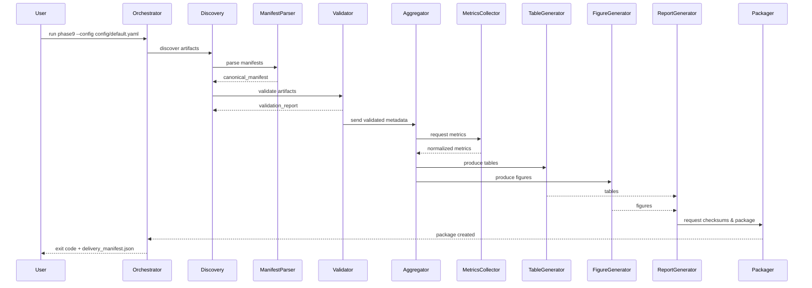
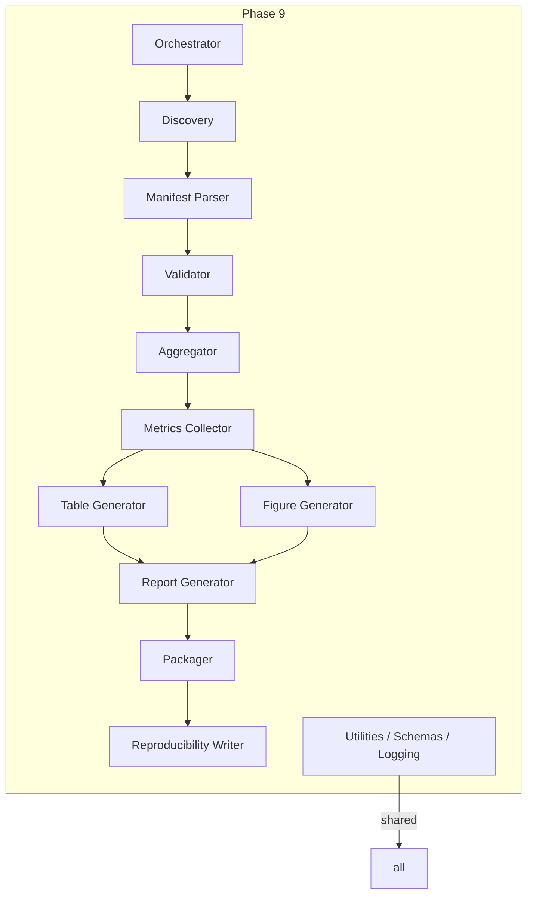
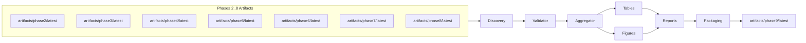

# Phase 9 — Architecture and Design Specification

Project: Anomaly and Fault Detection in Wireless Systems

Author: Phase 9 Architecture Team

Date: 2026-07-29

Version: 1.1

Status: Draft — Architecture & Design Specification

--------------------------------------------------------------------------------

Revision History
----------------

| Version | Date       | Author                | Change Summary |
|--------:|------------|-----------------------|----------------|
| 1.0     | 2026-07-29 | Architecture Team     | Initial release — complete Phase 9 architecture and design |
| 1.1     | 2026-07-29 | Architecture Team     | Add Artifact Resolver, Artifact Registry, Published Artifact Contracts, Data Models, Execution Pipeline, Dependency Matrix, Completion Criteria, Extensibility, ADRs |

--------------------------------------------------------------------------------

Table of Contents
-----------------

1. Introduction
2. Scope and Constraints
  2.1 Published Artifact Contracts
3. High-Level Architecture
   3.1 Architecture Principles
   3.2 Logical Components
   3.3 Deployment Boundaries
4. Module Design (per-module specification)
   4.1 Orchestrator / CLI
   4.2 Artifact Discovery
   4.3 Manifest Parser
   4.4 Artifact Validator
  4.13 Artifact Resolver
  4.14 Artifact Registry
   4.5 Metadata Aggregator
   4.6 Metrics & Statistics Collector
   4.7 Table Generator
   4.8 Figure Generator
   4.9 Report Generator
   4.10 Packaging & Checksum Manager
   4.11 Reproducibility Manifest Writer
   4.12 Utilities, Schemas, Exceptions, Logging
  4.15 Internal Architectural Data Models
5. Directory Structure
6. Data Flow — Discovery to Package
  6.1 Execution Pipeline (Numbered)
7. Sequence Diagrams
8. Component Diagrams
  8.1 Module Dependency Matrix
9. Output Artifacts (detailed)
10. Validation Strategy
11. Error Handling and Recovery
12. Configuration
13. Logging and Observability
14. Packaging and Delivery
15. Final Phase 9 Artifact Layout
  15.1 Phase 9 Completion Criteria
16. Non-functional Requirements
17. Security and Privacy Considerations
18. Appendix: Example Manifests and Schemas
  18.1 Standard Upstream Manifest Contract
19. Extensibility
20. Architectural Decision Records (ADRs)

--------------------------------------------------------------------------------

1. Introduction
---------------

This document defines the software architecture and design for Phase 9 of the dissertation project "Anomaly and Fault Detection in Wireless Systems". Phase 9 is a pure reporting, aggregation and packaging phase that consumes only artifacts published by Phases 2..8 under their respective artifacts/phaseX/latest/ directories. Phase 9 will not execute or re-run any previous phase.

The document is authoritative for implementing Phase 9 modules, their interfaces, validations and final deliverables.

2. Scope and Constraints
------------------------

- Inputs are limited strictly to: artifacts/phase2/latest/, ..., artifacts/phase8/latest/.
- If a phase exposes a manifest file that describes published outputs, the manifest must be used as the authoritative source for that phase's artifacts.
- Phase 9 must only discover, validate, aggregate, and package — no generation or retraining of models, no mutation of upstream artifacts.
- If an expected artifact is missing or incompatible, Phase 9 must report the condition and exit gracefully without attempting regeneration.

2.1 Published Artifact Contracts
--------------------------------

Purpose: Define the canonical published outputs Phase 9 consumes from Phases 2..8 and the minimal contract guarantees Phase 9 requires.

General contract rules:
- Every phase must publish a manifest file in `artifacts/phaseX/latest/manifest.(json|yaml)` when any artifacts are published. If a manifest is present, it is authoritative.
- Each published artifact entry must include: artifact id, relative path, artifact type, and optionally checksum and version.
- Metadata files (JSON/CSV) must be parseable and conform to the phase's published schema when provided.

Per-phase expected published outputs (minimal):

- Phase 2 (Dataset Validation & Profiling):
  - `dataset_profile.json` — dataset profiling summary
  - `data_quality_report.json` — data quality checks and failures
  - `manifest.(json|yaml)` — manifest referencing the above

- Phase 3 (Preprocessing & Feature Engineering):
  - `preprocessing_manifest.json` — description of preprocessing steps and parameters
  - `sequence_definitions.json` — sequence generation parameters
  - `manifest.(json|yaml)`

- Phase 4 (KPI Anomaly Detection):
  - `kpi_anomalies.json` — detected KPI anomaly listings
  - `evaluation_metrics.json` — per-experiment KPI metrics
  - `manifest.(json|yaml)`

- Phase 5 (DeepLog Training):
  - `model_metadata.json` — model hyperparameters and training metadata
  - `training_manifest.json` — training run references
  - `manifest.(json|yaml)`

- Phase 6 (DeepLog Inference):
  - `inference_results.json` — inference outputs summarised per experiment
  - `inference_manifest.json` — inference run metadata and runtime stats
  - `manifest.(json|yaml)`

- Phase 7 (Fusion Engine):
  - `fusion_results.json` — fusion outputs and fusion_metadata.json
  - `fusion_manifest.json`

- Phase 8 (Evaluation & Reporting):
  - `evaluation_report.json` — evaluation metrics per experiment
  - `statistical_analysis.json` — statistical tests and summaries
  - `experiment_report.pdf` — optional human readable report
  - `manifest.(json|yaml)`

These items form the minimum contracts Phase 9 expects. If a contract item is missing, Phase 9 must mark it in `validation_report.json` and continue according to configuration policies.

3. High-Level Architecture
--------------------------

3.1 Architecture Principles

- Single Responsibility: each module has one clear role.
- Explicit Interfaces: modules communicate through well-defined artifacts and metadata structures.
- Read-Only Upstream: Phase 9 reads published artifacts only — never writes upstream locations.
- Fail-Fast / Report-First: missing or incompatible inputs are reported clearly.
- Reproducibility: produce manifests and checksums so packaged outputs can be verified.

3.2 Logical Components

- Orchestrator / CLI: user interface to run Phase 9 workflows.
- Artifact Discovery: enumerate phase artifact directories and find manifests.
- Manifest Parser: canonicalize and parse manifests into internal metadata models.
- Artifact Validator: validate presence and schema compatibility of artifacts.
- Artifact Resolver: resolve published artifact locations and isolate filesystem layout from business logic.
- Artifact Registry (in-memory): authoritative registry of discovered and validated artifacts used at runtime.
- Metadata Aggregator: aggregate experiment, model, dataset metadata.
- Metrics & Statistics Collector: unify performance, runtime, and evaluation metrics.
- Table Generator: produce publication-ready tables (CSV/LaTeX/Markdown).
- Figure Generator: produce publication-ready figures (SVG/PDF/PNG) from numeric summaries and plot specs.
- Report Generator: assemble consolidated reports (PDF/HTML) and README.
- Packaging & Checksum Manager: create final deliverables with checksums and package manifests.
- Reproducibility Manifest Writer: create reproducibility metadata including source artifact checksums and environment notes.
- Utilities/Schemas/Exceptions/Logging: shared helpers, JSON/YAML schemas, centralized error types and logging.

3.3 Deployment Boundaries

Phase 9 is designed to run on the research environment (developer machines, CI runners or artifact servers). It needs read access to the workspace artifacts folder only and write access to artifacts/phase9/latest/ (final output) and logs/ or configured output locations.

4. Module Design (per-module specification)
-----------------------------------------

Each module entry includes Purpose, Responsibilities, Inputs, Outputs, Dependencies, Internal interactions, External interactions, Upstream phases, Downstream consumers, Error conditions, Validation performed, and Rationale.

4.1 Orchestrator / CLI

Purpose: Provide the runtime entrypoint to run Phase 9 actions and sub-workflows.

Responsibilities:
- Parse user options and configuration.
- Kick off discovery, validation, aggregation, report generation, packaging sequences.
- Emit execution summaries and final status codes.

Inputs: CLI args, runtime configuration files, environment variables.
Outputs: Execution logs, exit code, status artifacts (summary JSON), writes final outputs to artifacts/phase9/latest/.
Dependencies: Artifact Discovery, Logging, Config.
Internal interactions: invokes Artifact Discovery → Manifest Parser → Validator → Aggregator → Report Generator → Packager.
External interactions: None (read-only upstream files).
Upstream phases: Phases 2..8 artifacts.
Downstream consumers: Human reviewers, dissertation assembly processes, archival storage.
Error conditions: Missing configuration, insufficient permissions to write outputs, uncaught module exceptions.
Validation performed: CLI argument validation, config validation.
Rationale: Centralized control simplifies orchestration and enables reproducible invocation with explicit options.

4.2 Artifact Discovery

Purpose: Discover artifacts published by earlier phases using manifest-first discovery.

Responsibilities:
- Enumerate artifacts/phase{2..8}/latest/ directories.
- If a manifest exists in a phase folder, parse it (delegating to Manifest Parser) and use it to find artifacts; otherwise, apply a well-defined discovery fallback (list files but mark as manifest-missing).
- Produce a discovery index (structured JSON) listing found artifacts and manifest sources.

Inputs: Filesystem paths artifacts/phaseX/latest/.
Outputs: discovery_index.json (internal model), list of discovered artifact records.
Dependencies: Manifest Parser for manifest-first discovery, Logging.
Internal interactions: passes manifest files to Manifest Parser; reports to Validator for presence checks.
External interactions: filesystem read-only.
Upstream phases: 2..8.
Downstream consumers: Artifact Validator, Metadata Aggregator.
Error conditions: Unreadable directories, missing phase directories, missing manifests.
Validation performed: basic path existence, manifest presence flag.
Rationale: Centralizes discovery logic and enforces manifest-first rule.

4.3 Manifest Parser

Purpose: Parse phase manifests into canonical metadata models used by Phase 9.

Responsibilities:
- Support multiple manifest formats (JSON, YAML) defined by Phase X manifest schemas.
- Validate manifest schema (lightweight structural validation) and normalize keys.
- Map artifact entries to canonical ArtifactRecord objects: {phase, artifact_id, type, path, checksum?, version?, metadata: {...}}.

Inputs: manifest files discovered by Artifact Discovery.
Outputs: canonical manifest model objects (in-memory and persisted canonical_manifest.json).
Dependencies: Schemas (JSON Schema/YAML), Utilities for checksum reading.
Internal interactions: returns canonical models to Artifact Discovery and Validator.
External interactions: filesystem read-only.
Upstream phases: phases with manifests.
Downstream consumers: Validator, Aggregator.
Error conditions: invalid manifest schema, unknown fields, ambiguous artifact paths.
Validation performed: manifest structural validation, required fields presence.
Rationale: Having a canonical manifest model prevents divergent parsing logic downstream.

4.4 Artifact Validator

Purpose: Validate availability and compatibility of published artifacts without executing upstream phases.

Responsibilities:
- For each discovered artifact confirm file existence, expected content type (by extension & optional magic bytes), and checksum if provided.
- Validate artifact schema where applicable (e.g., JSON schema for metadata files, CSV header checks, model metadata file shapes) — but do not validate binary model internals beyond presence and metadata.
- Validate version compatibility (e.g., expected pydantic/torch/tensorflow versions recorded in artifact metadata) and manifest compatibility.
- Detect duplicate artifacts (same logical id, multiple paths) and mark conflicts.

Inputs: discovery index, canonical_manifest models, schemas for artifact types.
Outputs: validation_report.json and detailed validation entries per artifact.
Dependencies: Schemas, Utilities (checksum), Logging.
Internal interactions: sends errors to Exceptions module, summarises to Aggregator.
External interactions: filesystem read-only.
Upstream phases: all.
Downstream consumers: Aggregator, CLI for final exit codes.
Error conditions: missing artifact, checksum mismatch, schema mismatch, duplicate artifacts.
Validation performed: existence, checksum verification, schema structural validation, manifest compatibility checks.
Rationale: Ensures that only verified and compatible artifacts move forward into aggregation and report generation.

4.5 Metadata Aggregator

Purpose: Aggregate metadata from experiments, datasets, and models across phases into unified tables and JSON summaries.

Responsibilities:
- Consolidate experiment metadata (IDs, timestamps, descriptions) from phase manifests.
- Merge model metadata (architecture, hyperparameters, training artifacts references) without loading models.
- Merge dataset summaries (counts, profiling statistics) produced by Phase 2/3 outputs.
- Consolidate pipeline-level metadata (sequence generation parameters, gating thresholds).
- Produce experiment_manifest.json, model_summary.csv, dataset_summary.csv.

Inputs: canonical manifests, validation reports, per-artifact metadata files (JSON/CSV) referenced by manifests.
Outputs: aggregated metadata files (JSON/CSV) and in-memory models used by Table/Figure/Report generators.
Dependencies: Manifest Parser, Validator, Schemas.
Internal interactions: exposes aggregated models to Metrics Collector, Table/Report generation modules.
External interactions: writes aggregated artifacts into working output tree under artifacts/phase9/latest/intermediate_metadata/.
Upstream phases: 2..8 artifacts.
Downstream consumers: Table Generator, Figure Generator, Report Generator, Packager.
Error conditions: conflicting metadata across phases, missing metadata fields, ambiguous experiment ids.
Validation performed: cross-artifact consistency checks (e.g., model referenced by phase6 exists in phase5 manifest), uniqueness constraints.
Rationale: A single source of truth for all metadata simplifies report generation and ensures consistency for publication assets.

4.6 Metrics & Statistics Collector

Purpose: Collect and normalize performance and runtime statistics across experiments for comparative analysis.

Responsibilities:
- Parse and normalize evaluation metrics (precision, recall, F1, AUC, confusion matrices) produced by Phase 4/8/7.
- Aggregate runtime statistics (latency, throughput) reported by inference and fusion phases.
- Normalize metric names and units and annotate with experiment and model references.
- Produce pipeline_summary.csv, runtime_statistics.csv, model_comparison.csv, confusion_metrics.csv.

Inputs: metrics JSON/CSV files referenced by manifests and aggregated metadata models.
Outputs: normalized metrics CSV/JSON and metrics_index.json.
Dependencies: Aggregator, Schemas.
Internal interactions: supplies numeric tables to Table Generator and Figure Generator.
External interactions: none; writes only to phase9 output.
Upstream phases: phases that produce metrics (4,6,7,8).
Downstream consumers: Table Generator, Figure Generator, Report Generator.
Error conditions: inconsistent metric units, missing metric definitions, corrupted CSV/JSON.
Validation performed: unit normalization, value range checks, missing values detection.
Rationale: Centralized metric normalization facilitates fair model comparisons and publication-ready outputs.

4.7 Table Generator

Purpose: Produce publication-ready tables in CSV, LaTeX and Markdown formats.

Responsibilities:
- Render aggregated metadata and metrics into configurable table templates.
- Export tables as CSV for data archival, as Markdown for README and as LaTeX for dissertation inclusion.
- Provide table metadata (source artifacts, generation timestamp, generator version) to the reproducibility manifest.

Inputs: Aggregated metadata, normalized metrics, table templates configuration.
Outputs: publication tables: publication_tables/*.csv, *.md, *.tex.
Dependencies: Aggregator, Metrics Collector, Templates.
Internal interactions: communicates table provenance to Reproducibility Manifest Writer.
External interactions: none.
Upstream phases: uses only aggregated inputs from phases 2..8 via Aggregator.
Downstream consumers: Report Generator, human authors.
Error conditions: template rendering errors, missing columns required by templates.
Validation performed: column presence checks, cell formatting checks.
Rationale: Separates concerns between data computation (aggregator) and presentation (table generator) and ensures reproducible tabular outputs.

4.8 Figure Generator

Purpose: Create publication-quality figures (charts, plots) from aggregated numbers — no raw data scanning.

Responsibilities:
- Render standardized figure types (line plots, bar charts, ROC curves, confusion-matrix heatmaps) from numeric inputs.
- Export vector outputs (SVG, PDF) and raster fallbacks (PNG) following reproducibility settings (DPI, fonts).
- Keep figure provenance and parameters in figure_metadata.json.

Inputs: normalized metrics, aggregated metadata, figure templates/specs.
Outputs: artifacts/phase9/latest/figures/*.svg|.pdf|.png and figure_metadata.json.
Dependencies: Metrics Collector, Template specs, plotting libs (documented as external dependencies but not invoked here in architecture).
Internal interactions: negotiate with Table Generator and Report Generator for layout and references.
External interactions: none; writes to phase9 output.
Upstream phases: metrics-producing phases.
Downstream consumers: Report Generator, dissertation authors.
Error conditions: missing numeric series for expected plots, unit mismatches, unsupported plot types.
Validation performed: numeric series length checks, NaN detection.
Rationale: Centralizes figure rendering and enforces consistent visual styling across publications.

4.9 Report Generator

Purpose: Assemble final dissertation-ready consolidated reports (PDF/HTML) and a README describing the packaged deliverables.

Responsibilities:
- Merge tables, figures and textual experiment summaries into templated reports.
- Create an index README.md and brief executive summary (phase9_executive_summary.md).
- Export final report(s) and a delivery_manifest.json listing all files and their checksums.

Inputs: tables, figures, aggregated metadata, experiment summaries.
Outputs: final_report.pdf, final_report.html, README.md, delivery_manifest.json.
Dependencies: Table Generator, Figure Generator, Packaging Manager.
Internal interactions: request checksums from Packaging Manager, annotate report with provenance.
External interactions: none; writes to phase9 output.
Upstream phases: all via aggregated inputs.
Downstream consumers: dissertation submission systems, archival storage.
Error conditions: missing tables/figures referenced by template, rendering failures.
Validation performed: presence of referenced assets, cross-checks between delivery_manifest and actual outputs.
Rationale: Produces the assembled artifacts used by reviewers and archive systems.

4.10 Packaging & Checksum Manager

Purpose: Create reproducible delivery packages including file manifests and cryptographic checksums.

Responsibilities:
- Compute SHA256 checksums for all artifacts included in the Phase 9 package.
- Produce package_manifest.json and delivery_manifest.json listing files, sizes, checksums, and provenance (source artifact references).
- Create final delivery package (ZIP/TAR) and optionally a signed manifest.

Inputs: final report files, tables, figures, aggregated metadata.
Outputs: artifacts/phase9/latest/package_phase9_{timestamp}.zip, package_manifest.json, checksums.sha256
Dependencies: Utilities (checksum), Reproducibility Manifest Writer.
Internal interactions: provide checksum data to Report Generator for in-report listing.
External interactions: may push to archival storage if configured (external uploader is optional and pluggable).
Upstream phases: none directly — packages assembled from phase9 outputs only.
Downstream consumers: archival systems, human reviewers.
Error conditions: I/O errors during packaging, insufficient disk space.
Validation performed: checksum correctness verification post-package creation.
Rationale: Ensures deliverables are verifiable and integrity-protected.

4.11 Reproducibility Manifest Writer

Purpose: Emit metadata that allows exact reconstruction of the Phase 9 package provenance and the identities of upstream artifacts used.

Responsibilities:
- Write reproducibility.json with entries: {artifact_record, source_path, source_checksum, manifest_source, discovery_timestamp, aggregator_version, report_version, environment_notes (optional)}.
- Record tool versions used to generate the Phase 9 outputs (e.g., Phase 9 generator version, config hash).

Inputs: discovery index, validator report, package manifest, environment information.
Outputs: reproducibility.json, reproducibility_human_readable.md
Dependencies: Utilities, Packaging Manager.
Internal interactions: written last, after checksums available.
External interactions: none.
Upstream phases: references only.
Downstream consumers: archival systems, reproducibility audits.
Error conditions: missing checksums for referenced artifacts.
Validation performed: cross-check that all referenced upstream artifacts exist in discovery index and their checksums match when present.
Rationale: Reproducibility is a core research requirement; writing a single canonical manifest simplifies audits.

4.12 Utilities, Schemas, Exceptions, Logging

Purpose: Shared code and artifacts used by all modules: JSON/YAML schemas, exception classes, logging configuration, helper functions.

Responsibilities:
- Provide canonical JSON Schemas for expected manifest and metadata artifact types.
- Provide exception classes for standardized error handling.
- Centralize logging configuration with structured log messages.
- Provide checksum utilities, file type detection helpers, and template management.

Inputs: none (internal resources).
Outputs: utilities used by modules.
Dependencies: none external to Phase 9.
Internal interactions: used by all modules.
External interactions: none.
Rationale: Keep shared logic centralized to reduce repeated code and ensure consistent behavior.

4.13 Artifact Resolver

Purpose: Resolve artifact logical identifiers to physical filesystem locations and abstract filesystem layout from downstream modules.

Responsibilities:
- Accept canonical artifact records (id, phase, relative path) and resolve to absolute, validated filesystem URIs.
- Apply path mapping rules and configurable root overrides (e.g., artifacts root, archival mounts).
- Expose a pluggable resolver interface to support local filesystem, NFS, and object-storage-backed mounts (read-only adapters).

Inputs: canonical manifests, discovery_index entries, configuration for path mappings.
Outputs: resolved artifact entries with absolute paths and access metadata (exists, readable, size, modified_time).
Dependencies: Utilities (path and IO helpers), Artifact Discovery.
Internal interactions: called by Artifact Validator and Artifact Registry to obtain physical path and metadata.
External interactions: filesystem read-only or configured storage adapters.
Upstream phases: discovery and manifest parser outputs.
Downstream consumers: Validator, Artifact Registry, Aggregator.
Error conditions: path mapping failures, unresolved relative paths, inaccessible mounts.
Validation performed: basic existence and readability checks; delegate schema validation to Validator.
Rationale: Decouples business logic from environment-specific filesystem layout and eases testing and migration to alternate storage.

4.14 Artifact Registry (in-memory)

Purpose: Maintain an authoritative in-memory registry of discovered, resolved and validated artifacts for the Phase 9 runtime.

Responsibilities:
- Accept discovery records, resolved paths from Artifact Resolver and validation status from Artifact Validator.
- Store canonical ArtifactRecord objects keyed by artifact id and phase, support lookups by id, phase, type, or provenance.
- Provide efficient query APIs for Aggregator, Metrics Collector, and Report Generator to find artifacts and their statuses.
- Persist a snapshot of the registry to `manifests/canonical_manifest.json` after validation as the authoritative persisted registry.

Inputs: discovery_index.json, resolved artifact metadata, validation_report entries.
Outputs: in-memory registry API and persisted canonical_manifest.json snapshot.
Dependencies: Artifact Resolver, Artifact Validator, Utilities.
Internal interactions: queried by Aggregator, Metrics Collector, Table/Figure/Report modules.
External interactions: none; registry is local to Phase 9 runtime and persisted under phase9/manifests/ for auditing.
Upstream phases: phases 2..8 artifacts.
Downstream consumers: Aggregator, Report Generator, Packaging Manager.
Error conditions: conflicting primary keys, attempts to register duplicate artifact ids without configured policy.
Validation performed: uniqueness constraints, canonical field normalization.
Rationale: A single authoritative registry simplifies lookups and ensures that downstream modules operate on validated, resolved entries only.

4.15 Internal Architectural Data Models

Purpose: Define the canonical in-memory data models exchanged between Phase 9 modules. These are logical schemas (not implementation classes) used for clear interfaces.

ArtifactRecord:
- id: string — canonical artifact identifier (unique within a phase)
- phase: integer — upstream phase number
- type: string — artifact type (e.g., 'dataset_profile', 'model_metadata', 'metrics')
- relative_path: string — path as declared in manifest
- resolved_path: string|null — absolute path resolved by Artifact Resolver
- checksum: string|null — checksum declared in upstream manifest
- size_bytes: integer|null — file size discovered by resolver
- last_modified: timestamp|null — file mtime
- metadata: object — artifact-specific metadata (free-form)
- validation: {status: 'valid'|'invalid'|'warning'|'missing', errors: [...]} — validator output

ExperimentRecord:
- experiment_id: string
- title: string|null
- description: string|null
- phases: list of {phase: int, artifacts: [ArtifactRecord ids]}
- timestamps: {created, updated}

MetricRecord:
- id: string
- experiment_id: string
- model_id: string|null
- name: string (e.g., 'precision')
- value: number
- unit: string|null
- timestamp: timestamp
- context: object (additional labels: dataset, fold, threshold)

DatasetRecord:
- id: string
- name: string
- profile_summary: object (counts, columns, types)
- provenance: {artifact_id, phase}

ModelRecord:
- id: string
- architecture: string|null
- hyperparameters: object
- training_artifact: ArtifactRecord id
- provenance: {artifact_id, phase}

RuntimeRecord:
- id: string
- experiment_id: string
- metric: string
- value: number
- unit: string
- measurement_window: {start, end}

FigureRecord:
- id: string
- source_artifacts: [ArtifactRecord ids]
- type: string (e.g., 'roc', 'confusion')
- path: string
- format: string
- parameters: object

TableRecord:
- id: string
- source_artifacts: [ArtifactRecord ids]
- columns: [string]
- path: string
- format: string

Rationale: Explicit shared data models make module contracts unambiguous and reduce integration errors. They also form the basis for JSON schemas used for persisted artifacts.

5. Directory Structure
----------------------

Top-level layout (inside project root):

- phase9/
  - config/
    - default.yaml
    - templates.yaml
  - discovery/
    - discovery_index.json
  - manifests/
    - canonical_manifest.json
  - validation/
    - validation_report.json
  - aggregation/
    - aggregated_metadata.json
    - model_summary.csv
    - dataset_summary.csv
  - metrics/
    - metrics_index.json
    - runtime_statistics.csv
  - tables/
    - publication_tables/
  - figures/
    - figure_metadata.json
    - svg/ pdf/ png/
  - reports/
    - final_report.pdf
    - final_report.html
    - README.md
  - packaging/
    - package_manifest.json
    - package_phase9_<ts>.zip

8.1 Module Dependency Matrix
----------------------------

This matrix lists dependencies between Phase 9 modules (rows depend on columns). An 'X' indicates a dependency.

| Module \ Depends On | Orchestrator | Discovery | ManifestParser | Resolver | Validator | Registry | Aggregator | Metrics | Tables | Figures | Reports | Packager | Reproducibility | Utilities |
|---|---:|---:|---:|---:|---:|---:|---:|---:|---:|---:|---:|---:|---:|---:|
| Orchestrator |  | X | X | X | X | X | X | X | X | X | X | X | X | X |
| Discovery |  |  | X | X |  |  |  |  |  |  |  |  |  | X |
| ManifestParser |  |  |  |  | X |  |  |  |  |  |  |  |  | X |
| Resolver |  |  |  |  | X |  |  |  |  |  |  |  |  | X |
| Validator |  |  |  |  |  | X |  |  |  |  |  |  |  | X |
| Registry |  |  |  |  |  |  | X |  |  |  |  |  |  | X |
| Aggregator |  |  |  |  |  | X |  | X |  |  |  |  |  | X |
| Metrics |  |  |  |  |  | X | X |  |  |  |  |  |  | X |
| Tables |  |  |  |  |  | X | X | X |  |  |  |  |  | X |
| Figures |  |  |  |  |  | X | X | X |  |  |  |  |  | X |
| Reports |  |  |  |  |  | X | X | X | X | X |  |  |  | X |
| Packager |  |  |  |  |  | X | X |  | X | X | X |  |  | X |
| Reproducibility |  |  |  |  |  | X | X | X | X | X | X | X |  | X |
| Utilities |  |  |  |  |  |  |  |  |  |  |  |  |  |  |

Mermaid visualization of dependencies:

    - checksums.sha256
  - reproducibility/
    - reproducibility.json
  - schemas/
    - manifest.schema.json
    - metadata.schema.json
  - logs/
    - phase9.log
  - docs/
    - PHASE9_README.md
  - tests/
    - unit/ integration/ (spec files; architecture only — no implementation)

Rationale: Separate folders map to logical modules and make final package assembly straightforward.

6. Data Flow — Discovery to Package
-----------------------------------

Step-by-step flow description:

1. Orchestrator reads runtime config and options.
2. Artifact Discovery enumerates artifacts/phase2..8/latest/.
   - For each phase: if manifest exists, forward to Manifest Parser; otherwise list files and mark manifest-missing.
3. Manifest Parser normalizes manifests to canonical_manifest.json.
4. Artifact Validator checks each artifact for presence, schema compatibility and optional checksum consistency.
   - Validation errors are collected but do not cause immediate artifact deletion.
5. Aggregator consumes validated artifact metadata and builds aggregated_metadata.json and model/dataset summaries.
6. Metrics Collector normalizes evaluation metrics into runtime_statistics.csv and model_comparison.csv.
7. Table Generator creates publication-ready tables from aggregated metadata and metrics.
8. Figure Generator builds publication-quality figures from numeric summaries.
9. Report Generator composes final_report.pdf/html and README.md with embedded provenance links.
10. Packaging Manager computes checksums and writes package_manifest.json and package archive.
11. Reproducibility Manifest Writer writes reproducibility.json, referencing all upstream artifact checksums.
12. Final outputs are written into artifacts/phase9/latest/ and a delivery summary is emitted to console/log.

6.1 Execution Pipeline (Numbered)
---------------------------------

This explicit execution pipeline defines Phase 9's ordered steps (each step corresponds to one or more modules):

1. Load configuration and resolve runtime options (Orchestrator).
2. Initialize logging, schemas and utilities (Utilities).
3. Artifact Discovery: enumerate `artifacts/phaseX/latest/` for configured phases.
4. For each discovered manifest or artifact entry, invoke Manifest Parser to normalize records.
5. Artifact Resolver resolves logical relative paths to absolute, accessible locations.
6. Artifact Validator performs Level 0..4 checks and produces `validation_report.json`.
7. Artifact Registry ingests resolved and validated ArtifactRecords and becomes authoritative runtime registry.
8. Metadata Aggregator queries Artifact Registry to build ExperimentRecord, ModelRecord and DatasetRecord aggregates.
9. Metrics & Statistics Collector normalizes metrics across experiments and produces MetricRecords and RuntimeRecords.
10. Table Generator and Figure Generator render publication assets from aggregated models and MetricRecords.
11. Report Generator assembles publication-ready reports and composes delivery manifests.
12. Packaging & Checksum Manager stages files, computes checksums and produces `package_manifest.json` and archive.
13. Reproducibility Manifest Writer finalizes `reproducibility.json` referencing upstream checksums and registry snapshot.
14. Orchestrator emits run_summary.json, final status and exits.

Notes: Steps are designed to be modular and re-runnable where intermediate artifacts exist. The Artifact Registry snapshot (step 7) is the canonical runtime source for subsequent steps.

Mermaid data-flow diagram:

7. Sequence Diagrams
--------------------

High-level sequence for a full Phase 9 run:

8. Component Diagrams
---------------------

9. Output Artifacts (detailed)
-----------------------------

Table: Primary Phase 9 output artifacts

| Artifact | Purpose | Producer | Consumer | Format | Location |
|---|---|---|---:|---|---|
| discovery_index.json | Discovery index of upstream artifacts | Artifact Discovery | Validator, Aggregator | JSON | phase9/discovery/
| canonical_manifest.json | Normalized manifests | Manifest Parser | Validator, Aggregator | JSON | phase9/manifests/
| validation_report.json | Artifact validation details | Validator | Aggregator, CLI | JSON | phase9/validation/
| aggregated_metadata.json | All aggregated metadata | Aggregator | Tables/Figures/Reports | JSON | phase9/aggregation/
| model_summary.csv | Per-model metadata table | Aggregator | Table Generator, Authors | CSV | phase9/aggregation/
| dataset_summary.csv | Dataset metadata summary | Aggregator | Table Generator | CSV | phase9/aggregation/
| runtime_statistics.csv | System runtime metrics | Metrics Collector | Figures, Reports | CSV | phase9/metrics/
| model_comparison.csv | Comparative metrics | Metrics Collector | Tables, Figures | CSV | phase9/metrics/
| publication_tables/*.csv| Publication table sources | Table Generator | Report Generator, Authors | CSV/MD/TEX | phase9/tables/
| figures/*.(svg|pdf|png) | Publication figures | Figure Generator | Report Generator, Authors | SVG/PDF/PNG | phase9/figures/
| final_report.pdf | Consolidated report | Report Generator | Reviewers | PDF | phase9/reports/
| delivery_manifest.json | Inventory of deliverables | Packaging Manager | Reviewer/Archive | JSON | phase9/packaging/
| package_phase9_<ts>.zip | Final delivery package | Packaging Manager | Archive/Reviewer | ZIP | phase9/packaging/
| reproducibility.json | Provenance and checksums | Reproducibility Writer | Auditor | JSON | phase9/reproducibility/

For each artifact, the Producer must include provenance metadata (source artifact references and discovery timestamps).

10. Validation Strategy
-----------------------

Validation is tiered and non-invasive — it does not open or execute models or reprocess raw datasets. Levels:

- Level 0 — Presence: file exists at path declared by manifest/discovery.
- Level 1 — Sanity: file extension & basic header checks (e.g., JSON parseable; CSV headers present).
- Level 2 — Schema: validate JSON/CSV against provided schemas (manifest.schema.json, metadata.schema.json).
- Level 3 — Checksum: if upstream manifest provides checksum, verify it matches the file on disk.
- Level 4 — Cross-artifact Consistency: ensure references between phases (model referenced in phase6 is described in phase5 manifest) hold true.

Validation Notes and Rules:

- If a manifest exists, it is authoritative; discovery must follow the manifest entries.
- Missing artifacts are flagged in validation_report.json with classification (missing, optional-missing, deprecated).
- Schema mismatches are reported with path, expected schema id, and validation errors. The artifact is marked invalid but retained in index.
- Duplicate artifacts (same logical id) are recorded with both candidate paths; validator marks primary by config policy (first-wins or prefer-by-manifest).

11. Error Handling and Recovery
-----------------------------

Centralized Error Handling Strategy:

- All modules raise structured exceptions defined in Utilities/Exceptions.
- The Orchestrator catches high-level exceptions and ensures consistent exit codes and a final summary log.
- Errors are categorized as Recoverable or Fatal.

Recoverable errors:
- Missing optional artifacts (logged as warnings).
- Non-critical figure generation failures (skip figure, continue packaging with warning).

Fatal errors:
- Missing mandatory artifacts required by configured report templates.
- Corrupted manifests that prevent canonical parsing.
- Filesystem write permission failures when writing final outputs.

Logging strategy:
- Structured JSON logs written to phase9/logs/phase9.log and optionally to stdout.
- Every error entry includes: timestamp, module, error_code, artifact_reference (if applicable), message, remediation_hint.

Recovery strategy:
- For recoverable issues, continue pipeline while marking missing assets in delivery manifest.
- For fatal issues, stop pipeline, write validation_report.json and reproducibility notes, and return non-zero exit code.

Failure reporting:
- A single summary file phase9/validation/failure_summary.json lists fatal errors and suggested next steps for the dissertation author.

12. Configuration
-----------------

Configuration is file-driven with environment variable overrides.

Files:
- phase9/config/default.yaml — default runtime settings (paths, policies, template selections).
- phase9/config/templates.yaml — report and figure template selection.

Runtime options (examples):
- --config PATH (specify config file)
- --phases "2,3,4,5,6,7,8" (subset discovery)
- --out artifacts/phase9/latest/ (override output)
- --policy duplicate_resolution (first-wins|prefer-manifest|fail-on-duplicate)

Feature flags:
- enable_figure_generation: boolean (if false, skip figure generation)
- include_optional_artifacts: boolean

Environment variables:
- PHASE9_OUTPUT_DIR
- PHASE9_LOG_LEVEL

Extensibility: config supports adding new artifact types and new report templates without code changes; templates are discovered under config/templates/*.

13. Logging and Observability
----------------------------

Logging hierarchy:

- phase9 (root)
  - phase9.discovery
  - phase9.manifest
  - phase9.validation
  - phase9.aggregation
  - phase9.metrics
  - phase9.generation
  - phase9.packaging

Log levels: DEBUG, INFO, WARNING, ERROR, CRITICAL

Log Destinations:
- Structured log file: phase9/logs/phase9.log (JSON lines)
- Console: INFO+ summary
- Optional: telemetry endpoint (pluggable, requires configuration)

Execution summaries: The Orchestrator writes run_summary.json with timings, artifact counts, errors counts, and final package path.

Artifact summaries: Validator writes artifact-level validation entries with severity and remediation hints.

14. Packaging and Delivery
-------------------------

Packaging steps:

1. Collate files under a staging directory (phase9/packaging/staging/<timestamp>/).
2. Ensure delivery_manifest.json contains file paths, sizes, SHA256 checksums and source provenance.
3. Create compressed archive (zip or tar.gz) with stable ordering (e.g., lexicographic) to ensure reproducible archives.
4. Write checksums.sha256 and package_manifest.json.

Reproducibility measures:
- Compute SHA256 for all included files and record upstream artifact checksums when present.
- Record the Phase 9 tool version and configuration hash used to create the package.
- Use deterministic archive creation settings (no timestamps in zip entries, fixed file order) where the packaging tool supports it.

15. Final Phase 9 Artifact Layout
--------------------------------

After successful execution, artifacts/phase9/latest/ will contain:

- /artifacts/phase9/latest/
  - discovery_index.json — index of discovered upstream artifacts
  - canonical_manifest.json — normalized manifests merged
  - validation_report.json — per-artifact validation
  - aggregated_metadata.json — combined metadata JSON
  - model_summary.csv
  - dataset_summary.csv
  - runtime_statistics.csv
  - model_comparison.csv
  - publication_tables/ (CSV/MD/TEX files and metadata)
  - figures/ (SVG/PDF/PNG and figure_metadata.json)
  - reports/final_report.pdf
  - reports/final_report.html
  - reports/README.md
  - packaging/package_phase9_<ts>.zip
  - packaging/package_manifest.json
  - packaging/checksums.sha256
  - reproducibility/reproducibility.json
  - logs/phase9.log

Explanation of each file (purpose summarized):

- discovery_index.json — record of what Phase 9 found in upstream phase folders and which manifests were used.
- canonical_manifest.json — canonical, merged representation of manifest data used across modules.
- validation_report.json — full validation detail; mandatory artifacts missing produce fatal entries.
- aggregated_metadata.json — master metadata used to generate tables and reports.
- model_summary.csv / dataset_summary.csv — ready-to-use summary tables for publication and appendix.
- runtime_statistics.csv / model_comparison.csv — normalized metrics for figures and comparison tables.
- publication_tables/ — human-reviewable tables for dissertation figures and tables.
- figures/ — publication-quality visualizations.
- reports/* — final assembled deliverables.
- packaging/* — the distributable package and manifest.
- reproducibility/* — complete provenance and checksums for auditing.

15.1 Phase 9 Completion Criteria
--------------------------------

The following exact conditions define a successful Phase 9 execution. All criteria must be satisfied (or marked as intentionally waived in configuration) for the run to be considered successful.

Mandatory criteria:
- discovery_index.json exists and lists at least one upstream phase directory scanned.
- canonical_manifest.json persisted snapshot exists and is non-empty.
- validation_report.json exists and contains no fatal errors. Fatal errors are: missing mandatory artifacts declared required by configured templates, corrupted canonical manifests preventing parsing, or inability to write final outputs.
- aggregated_metadata.json exists and includes at least one ExperimentRecord.
- All publication tables referenced by the selected report template exist and are marked valid.
- All figures referenced by the selected report template exist and are marked valid or flagged as optional in configuration.
- package_phase9_<ts>.zip exists and `package_manifest.json` and `checksums.sha256` correctly list all package contents and checksums.
- reproducibility/reproducibility.json exists and references upstream artifact checksums where available.

Success markers written to `artifacts/phase9/latest/`:
- `run_summary.json` with status `success` and exit_code 0.
- `delivery_manifest.json` listing published outputs and checksums.

If any mandatory criterion fails, Phase 9 must mark the run as failed, write a `failure_summary.json` describing the reasons, and exit with non-zero code.

16. Non-functional Requirements
-----------------------------

- Performance: typical run time depends on number of artifacts; Phase 9 should be I/O-bound — architecture supports parallel validation and figure/table generation where appropriate.
- Scalability: support dozens to hundreds of experiments; discovery and validation are streamable.
- Maintainability: modular layout and JSON schema-driven parsing.
- Portability: designed to run on Windows/Linux/CI, dependent only on standard filesystem access and rendering tools for figures/reports.

17. Security and Privacy Considerations
-------------------------------------

- Phase 9 reads only published artifacts and should not inadvertently include raw private data. The manifest-first approach limits accidental exposure.
- Packaging should omit any credentials or secrets; config must allow explicit exclusion lists.
- Checksums and manifest records may contain file paths — consider redaction policies for public deliverables.

18. Appendix: Example Manifests and Schemas
-----------------------------------------

This appendix contains suggested minimal manifest and reproducibility schema examples. Implementation will follow these schema IDs and may extend them.

Suggested canonical manifest fields (example keys only):

- phase: integer
- experiment_id: string
- artifacts: list of {id, path, type, checksum?, metadata: {...}}

Suggested reproducibility.json fields:

- phase9_version
- generation_timestamp
- package_manifest: reference
- upstream_artifacts: list of {phase, id, path, checksum}

Mermaid summary architecture (compact):

18.1 Standard Upstream Manifest Contract
---------------------------------------

Phase 9 requires every upstream manifest to contain at minimum the following fields. This contract is used by the Manifest Parser and Validator to detect manifest compatibility issues.

Minimal manifest schema (semantic overview):

- manifest_version: string — semantic manifest version (e.g., "1.0")
- phase: integer — upstream phase number
- experiment_id: string|null — optional experiment identifier
- artifacts: array of objects, where each object contains:
  - id: string — artifact identifier unique within the phase
  - type: string — artifact type identifier
  - relative_path: string — path relative to artifacts/phaseX/latest/
  - checksum: string|null — algorithm:hex (e.g., sha256:...) optional but recommended
  - version: string|null — artifact-specific version tag
  - metadata: object|null — optional additional metadata
- generated_timestamp: string — ISO timestamp when the manifest was produced
- generator: object|null — tool that produced the manifest (name, version)

Validation notes:
- If `manifest_version` is missing, Manifest Parser should attempt a best-effort parse but mark the manifest as `manifest_version:unknown` in canonical_manifest.json.
- Paths must be relative and must not contain path traversal segments ("..") — the Resolver will enforce this.

Rationale: Keeping the manifest minimal yet explicit reduces coupling while providing sufficient information for Phase 9 discovery and validation.

19. Extensibility
-----------------

The Phase 9 architecture is intentionally modular and plugin-friendly. Key extension points:

- Artifact Resolver Adapters: new storage backends (S3, GCS, object-layer, archival mounts) can be added as read-only adapters implementing the resolver interface.
- Artifact Type Schemas: new artifact types may be added by providing JSON schemas under `phase9/schemas/` and updating template mappings in `phase9/config/templates.yaml`.
- Report and Template Plugins: Report Generator accepts template providers; add new templates without changing core aggregation logic.
- Packaging Targets: Packaging Manager supports pluggable delivery targets (local archive, remote object store, signed artifact service).

Extension guidance:
- Additions should register themselves with the Utilities registry and declare compatibility with manifest_version values.
- New artifact types MUST include a schema and a sample manifest entry to enable Validator and Manifest Parser support.

20. Architectural Decision Records (ADRs)
---------------------------------------

ADR-001: Manifest-First Discovery
- Decision: Phase 9 will treat any manifest in a phase directory as authoritative for that phase's published outputs.
- Rationale: Manifests provide explicit, human-verified contracts and simplify discovery; they reduce accidental inclusion of transient files.

ADR-002: Read-Only Upstream Policy
- Decision: Phase 9 will operate in read-only mode with respect to upstream artifact directories.
- Rationale: Prevents accidental regeneration or modification of upstream artifacts and keeps Phase 9 purely reporting/packaging.

ADR-003: Artifact Registry as Authority
- Decision: Introduce an in-memory Artifact Registry as the canonical runtime source after discovery and validation.
- Rationale: Centralizes artifact state, simplifies lookups and decouples modules from filesystem structure.

ADR-004: Checksum-Based Reproducibility
- Decision: Phase 9 will compute and include SHA256 checksums for all delivered artifacts and record upstream checksums when provided.
- Rationale: Cryptographic checksums are a minimal and robust mechanism to ensure reproducibility and integrity of deliverables.

ADR-005: Minimal Upstream Manifest Contract
- Decision: Define a small, stable manifest contract with fields (`manifest_version`, `phase`, `artifacts`, `generated_timestamp`, `generator`).
- Rationale: Minimizes coupling while ensuring required metadata is available for Phase 9 discovery and validation.

Closing Notes and Rationale
---------------------------

This architecture enforces the essential Phase 9 constraints: read-only upstream access, manifest-first discovery, clear separation between metadata aggregation and presentation layers, and strong reproducibility guarantees via checksums and manifests. Each module is sized to be implementable independently and testable via unit and integration tests that operate on sample manifests and small artifact collections.

Change control: future extensions (e.g., exporter to archival S3, signed package creation) should be added as modular plug-ins to the Packaging Manager and configured via phase9/config/default.yaml.

End of document.
